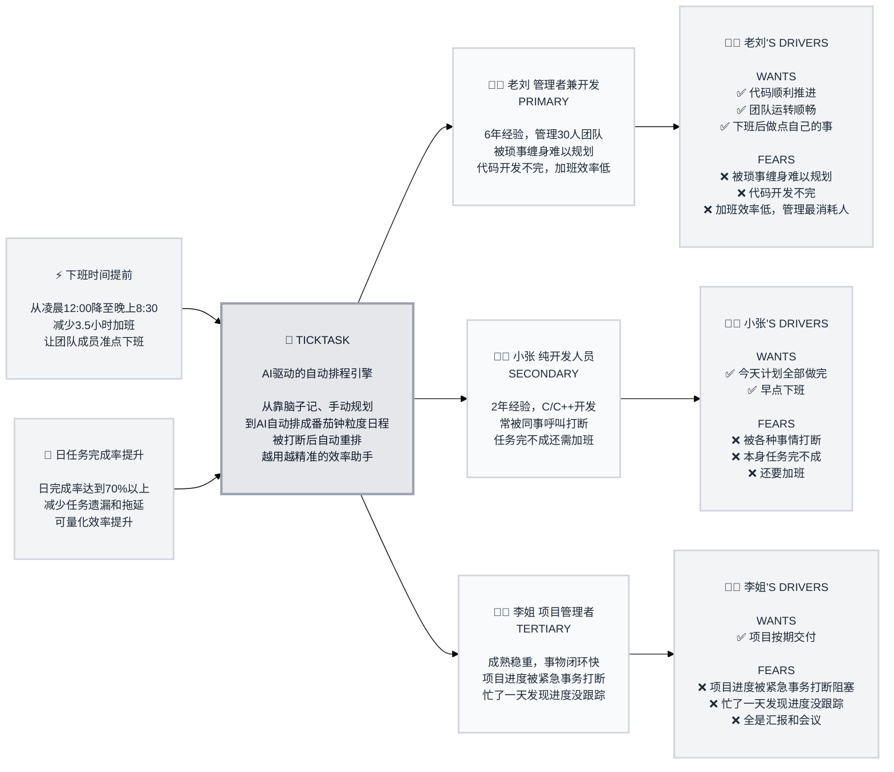

# Trigger Map Poster: TickTask

> Visual overview connecting business goals to user psychology

**Created:** 2026-05-24
**Author:** 老刘
**Methodology:** Based on Effect Mapping (Balic & Domingues), adapted for WDS framework

---

## Strategic Documents

This is the visual overview. For detailed documentation, see:

- **01-Business-Goals.md** - Full vision statements and SMART objectives
- **02-Target-Groups.md** - All personas with complete driving forces
- **03-Feature-Impact-Analysis.md** - Prioritized features with impact scores
- **04-老刘.md** - Primary persona detail
- **05-小张.md** - Secondary persona detail
- **06-李姐.md** - Tertiary persona detail

---

## Vision

打造一款智能效率助手，让用户只需告诉它"要做什么"，它来自动规划"怎么做"——按番茄钟粒度生成每日日程，被打断时自动调整，最终让用户感到"跟着做就行"的轻松。

---

## Business Objectives

### Objective 1: 下班时间提前

- **Metric:** 下班时间
- **Target:** 从凌晨12:00降至晚上8:30（减少3.5小时加班）
- **Timeline:** 产品打磨完成后自用1个月评估

### Objective 2: 日任务完成率提升

- **Metric:** 日完成任务数 / 日计划任务数
- **Target:** ≥ 70%
- **Timeline:** 产品打磨完成后自用1个月评估

---

## Target Groups (Prioritized)

### 1. 老刘 — 管理者兼开发人员 (PRIMARY)

**Priority Reasoning:** 杠杆用户——对他 Must Have 的特性自动覆盖小张。先让他受益，推广自然发生。他的痛点（被琐事缠身难以规划）是最高频的系统性问题。

> 6年工作经验，管理30人团队，既是Project Leader也是开发人员。一天中最头疼的是各种管理事务、汇报事务、进度跟踪、打断拉通对齐。代码开发不完，加班效率还低。希望能代码顺利推进，团队运转顺畅，下班后还能做点自己的事。

**Key Positive Drivers:**
- 代码顺利推进
- 团队运转顺畅
- 下班后还能做点自己的事

**Key Negative Drivers:**
- 被琐事缠身难以规划
- 代码开发不完，加班效率低
- 管理事务最消耗人

### 2. 小张 — 纯开发人员 (SECONDARY)

**Priority Reasoning:** 老刘的 Must Have 特性自动覆盖小张的需求。小张的核心痛点是打断后任务完不成，与老刘高度重叠。

> 2年工作经验，C/C++开发，平时靠脑子管理任务。经常遇到其他人的呼叫打断，任务完不成还要加班。希望能把一天计划全部做完，早点下班。

**Key Positive Drivers:**
- 今天计划全部做完
- 早点下班

**Key Negative Drivers:**
- 被各种事情打断
- 本身任务完不成
- 还要加班

### 3. 李姐 — 项目管理者 (TERTIARY)

**Priority Reasoning:** 当前得分偏低，产品核心是番茄钟粒度排程而非管理视图。是未来的扩展机会。

> 成熟稳重，事物闭环较快，可能已有自己的一套方法论。项目进度被各种紧急事务打断阻塞，忙了一天发现某个进度没有跟踪，也没时间跟踪，全是汇报和各种会议。希望项目按期交付。

**Key Positive Drivers:**
- 项目按期交付

**Key Negative Drivers:**
- 项目进度被紧急事务打断阻塞
- 忙了一天发现进度没跟踪
- 全是汇报和会议，没时间跟踪

---

## Trigger Map Visualization

---

## Design Focus Statement

**Top 4 Must Have 特性全部指向同一个链路：规划 → 执行 → 打断 → 调整 → 延期 → 提醒。** 构建完整的"秘书"工作流——不是帮用户记任务，而是帮用户安排好什么时间做什么、被打断后自动调整。

**Primary Design Target:** 老刘（管理者兼开发人员）

**Must Address:**
- AI 延迟提醒+建议 — 解决任务延期无人提醒（9分）
- AI 自动日程生成 — 解决从"人规划"到"AI代劳"（8分）
- AI 打断重排 — 解决打断后任务完不成（8分）
- 打断缓冲冗余 — 预防性方案，预留缓冲应对未知打断（8分）

**Should Address:**
- 效率数据分析 — 可视化反馈，看到时间花在哪（7分）
- 效率反馈闭环 — 历史数据反哺AI排程策略（7分）

---

## Cross-Group Patterns

### Shared Drivers

- **打断是最一致的痛点**：老刘、小张、李姐都在不同层面被"打断"困扰——老刘被琐事打断规划，小张被同事呼叫打断开发，李姐被紧急事务打断进度跟踪
- **准点下班是共同期望**：三个画像都希望减少加班，只是表述不同（做自己的事、早点下班、按期交付后正常下班）

### Unique Drivers

- **老刘独特：规划成本** — 身为管理者兼开发，双重身份导致事务多且杂，规划本身成为消耗。这是其他画像没有的痛点
- **小张独特：被动执行** — 作为初级开发，不是不会规划而是随时被呼叫打断，需要的是被打断后的恢复能力
- **李姐独特：全局视角** — 关注的是项目级进度而非个人任务，TickTask当前粒度偏个人，后续可扩展

### Potential Tensions

- **个人排程 vs. 团队视图**：老刘既是个人用户也是团队Leader，当前产品聚焦个人番茄钟排程，李姐需要的项目级进度跟踪暂未覆盖。老刘的"管理最消耗人"痛点部分源于缺少团队视图——待阶段二解决
- **AI自动分类 vs. 人工控制**：用户明确反馈"分类是人为控制的，AI拿不准任务的优先级"。设计时需确保AI排程建议可被人工覆写

---

## Next Steps

This Trigger Map Poster provides a quick reference. For detailed work:

- [ ] **Review detailed docs** — See 01-Business-Goals.md, 02-Target-Groups.md, 03-Feature-Impact-Analysis.md
- [ ] **Use for Feature Prioritization** — Reference feature impact scores
- [ ] **Guide UX Design** — Ensure designs address priority drivers
- [ ] **Validate with Users** — Test assumptions with real target group members
- [ ] **Update as Learnings Emerge** — This is a living document

---

_Generated with Whiteport Design Studio framework_
_Trigger Mapping methodology credits: Effect Mapping by Mijo Balic & Ingrid Domingues (inUse), adapted with negative driving forces_
