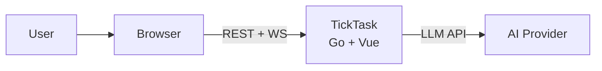

# TickTask Knowledge Base

基于 Mermaid + C4 模型的可视化知识库。提供"地图"（模块结构）和"路线"（业务流程）双轴导航。

## System Overview (C4 Level 1)

> 完整图: [system-context.md](system-context.md) | [container-architecture.md](container-architecture.md)

---

## By Module (地图)

核心模块的 C4 Component 蓝图，展示内部架构、对外接口和依赖关系。

| 模块 | 蓝图 | 职责 | 参与流程 |
|------|------|------|----------|
| **service** | [service.md](modules/service.md) | 业务逻辑编排 (Task/Timer/AI/Schedule/Analytics) | 3 flows |
| **ai** | [ai.md](modules/ai.md) | OpenAI 兼容 LLM 客户端 | 1 flow |
| **repository** | [repository.md](modules/repository.md) | GORM/SQLite 数据访问 (5 repos) | 1 flow |
| **api/handler** | [api-handler.md](modules/api-handler.md) | Gin HTTP 传输层 (6 handlers) | 2 flows |
| **websocket** | [websocket.md](modules/websocket.md) | gorilla/websocket Hub+Client | 2 flows |
| **stores** | [stores.md](modules/stores.md) | Pinia 状态管理 (5 stores) | 3 flows |
| **model** | [model.md](modules/model.md) | GORM 领域模型 (5 entities) | 1 flow |
| **api/client** | [api-client.md](modules/api-client.md) | Axios HTTP 客户端单例 | - |

> 完整索引: [modules/INDEX.md](modules/INDEX.md)

---

## By Flow (路线)

核心业务流程的 Mermaid 时序图，展示参与模块、调用链和异常路径。

| 流程 | 蓝图 | 类型 | 涉及模块 |
|------|------|------|----------|
| **Task Lifecycle** | [task-lifecycle.md](flows/task-lifecycle.md) | 同步 REST | 6 modules |
| **AI Schedule Generation** | [ai-schedule-generation.md](flows/ai-schedule-generation.md) | 混合 (REST + AI) | 7 modules |
| **Timer Session** | [timer-session.md](flows/timer-session.md) | 异步 goroutine + WS | 6 modules |
| **WebSocket Real-time** | [websocket-realtime.md](flows/websocket-realtime.md) | 异步 WS | 4 modules |
| **Schedule Revision** | [schedule-revision.md](flows/schedule-revision.md) | 混合 (两阶段) | 7 modules |

> 完整索引: [flows/INDEX.md](flows/INDEX.md)

---

## By Decision (决策)

| 编号 | 决策 | 状态 |
|------|------|------|
| ADR-0001 | [SQLite as DB](decisions/adr-0001-sqlite-as-db.md) | Accepted |
| ADR-0002 | [Manual DI](decisions/adr-0002-manual-di.md) | Accepted |
| ADR-0003 | [WebSocket Real-time](decisions/adr-0003-websocket-realtime.md) | Accepted |
| ADR-0004 | [OpenAI-Compatible AI](decisions/adr-0004-openai-compatible-ai.md) | Accepted |

> 完整索引: [decisions/INDEX.md](decisions/INDEX.md)

---

## Crosscutting Concerns

> 索引: [crosscutting/INDEX.md](crosscutting/INDEX.md)

---

## Quick Navigation

| 目录 | 内容 |
|------|------|
| [system-context.md](system-context.md) | C4 Level 1: 系统全景 |
| [container-architecture.md](container-architecture.md) | C4 Level 2: 容器架构 |
| [modules/](modules/) | C4 Level 3: 模块蓝图 (8 个) |
| [flows/](flows/) | 时序图: 核心流程 (5 条) |
| [decisions/](decisions/) | ADR: 架构决策记录 (4 篇) |
| [crosscutting/](crosscutting/) | 横切关注点索引 |
