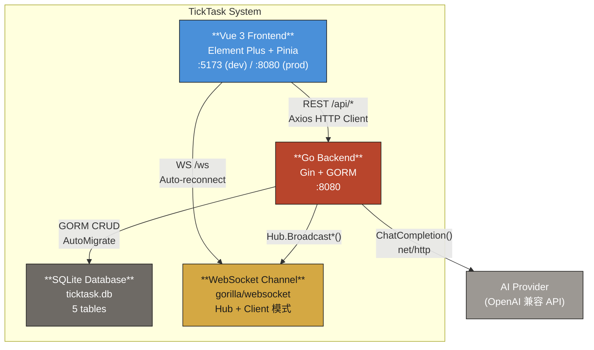

# Container Architecture (C4 Level 2)

TickTask 系统内部的容器（应用/服务/数据库）及其交互关系。



## 容器清单

| 容器 | 技术 | 职责 | 端口 |
|------|------|------|------|
| Go Backend | Go 1.21 / Gin 1.10 / GORM 1.25 | REST API、业务逻辑、AI 集成、WebSocket Hub、计时器 goroutine | :8080 |
| Vue 3 Frontend | Vue 3.5 / Pinia 2.2 / Element Plus 2.8 / Vite 5.4 | SPA 用户界面、状态管理、WebSocket 客户端 | :5173 (dev) |
| SQLite Database | SQLite via GORM | 持久化存储：tasks, sessions, schedules, settings, daily_stats | 本地文件 |
| WebSocket Channel | gorilla/websocket | 实时计时器状态推送、任务更新通知 | 共用 :8080 |

## 容器间通信

| 从 | 到 | 协议 | 数据流 |
|----|----|------|--------|
| Frontend | Backend | HTTP REST (JSON) | CRUD 操作、AI 请求、设置读写、分析查询 |
| Frontend | WebSocket Channel | WebSocket (JSON) | 接收计时器 tick、会话状态、完成通知 |
| Backend | SQLite | GORM (SQL) | 5 张表的 CRUD，AutoMigrate 非破坏性迁移 |
| Backend | WebSocket Channel | Go channel | Hub.Broadcast*() 方法推送消息到所有 Client |
| Backend | AI Provider | HTTPS POST (JSON) | 发送 prompt，接收 JSON 响应 |

## 部署模式

### 开发模式 (`make dev`)
```
Browser --> :5173 (Vite HMR) --> proxy /api/* --> :8080 (Go)
                                  proxy /ws    --> ws://:8080
```

### 生产模式 (`make prod`)
```
Browser --> :8080 (Go serves frontend dist/ + API + WebSocket)
```

## 参见

- [System Context](system-context.md) — 外部角色与系统边界
- [Module Blueprints](modules/) — 各模块内部架构
- [Flow Diagrams](flows/) — 核心流程时序图
