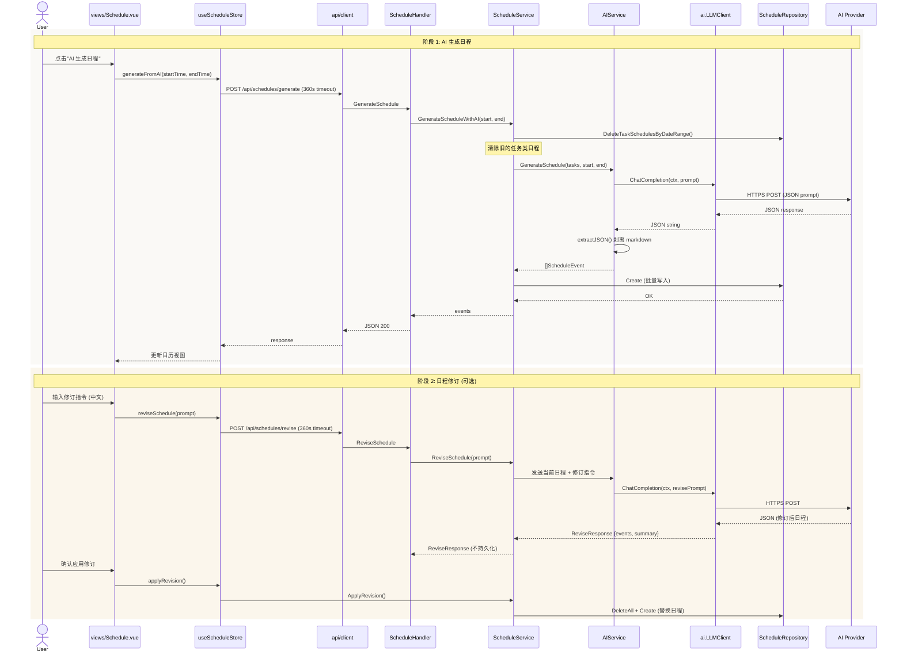

# Flow: AI Schedule Generation (AI 日程生成)

> 从任务列表出发，通过 LLM 生成每日日程的完整流程，含修订工作流。

## Sequence Diagram

## 参与模块

| 模块 | 角色 | 蓝图 |
|------|------|------|
| views/Schedule | UI 入口 | - |
| stores/schedule | 状态管理 | [stores](../modules/stores.md) |
| api/client | HTTP (360s 超时) | [api-client](../modules/api-client.md) |
| handler/ScheduleHandler | 请求处理 | [api-handler](../modules/api-handler.md) |
| service/ScheduleService | 业务逻辑 | [service](../modules/service.md) |
| service/AIService | LLM 调用 | [service](../modules/service.md) |
| ai/LLMClient | HTTP LLM 客户端 | [ai](../modules/ai.md) |

## 异常路径

| 场景 | 处理方式 |
|------|----------|
| AI 未配置 (无 API Key) | AIService 返回 nil → Handler 返回 503 |
| LLM 超时 | `context.WithTimeout` (60s 后端, 360s 前端) → 503 |
| LLM 返回非 JSON | `extractJSON()` 尝试剥离 markdown fence；失败 → 500 |
| LLM JSON 解析失败 | ScheduleService 返回错误 → Handler 500 |
| 时间区间无效 | ScheduleService 验证 → 400 |

## 关联

| 类型 | 链接 |
|------|------|
| 关联模块 | [ai](../modules/ai.md), [service](../modules/service.md) |
| 关联 ADR | [ADR-0004](../decisions/adr-0004-openai-compatible-ai.md) |
