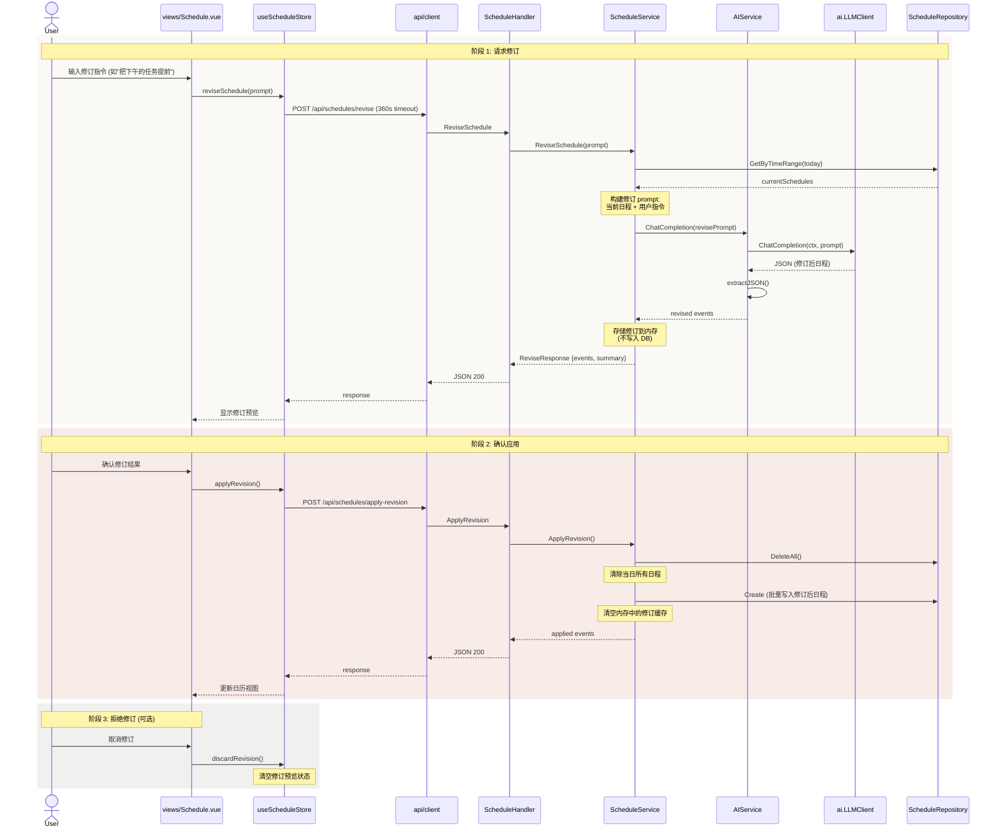

# Flow: Schedule Revision (日程修订)

> AI 日程修订工作流：用户提出修改需求 → LLM 生成修订方案 → 用户确认 → 应用修订。

## Sequence Diagram

## 参与模块

| 模块 | 角色 | 蓝图 |
|------|------|------|
| views/Schedule | UI 入口 (修订对话框) | - |
| stores/schedule | 状态管理 (预览 vs 正式) | [stores](../modules/stores.md) |
| api/client | HTTP (360s 超时) | [api-client](../modules/api-client.md) |
| handler/ScheduleHandler | 请求处理 | [api-handler](../modules/api-handler.md) |
| service/ScheduleService | 修订逻辑 (内存缓存) | [service](../modules/service.md) |
| service/AIService | LLM 调用 | [service](../modules/service.md) |
| repository/ScheduleRepo | 日程 CRUD | [repository](../modules/repository.md) |

## 关键设计

- **两阶段提交**：修订结果先缓存在 Service 内存中，用户确认后才持久化
- **全量替换**：应用修订时 DeleteAll + 批量 Create，非增量更新
- **长时间请求**：前端 API 超时 360 秒，适配 LLM 响应延迟

## 异常路径

| 场景 | 处理方式 |
|------|----------|
| AI 未配置 | Handler 返回 503 |
| LLM 返回无效 JSON | extractJSON 失败 → 500 |
| 修订过期 (后端重启) | 内存缓存丢失 → 提示用户重新修订 |
| 并发修订请求 | 后提交覆盖前一次 (Last Write Wins) |
| 空修订结果 | 返回空列表 → 前端显示"无需修改" |

## 关联

| 类型 | 链接 |
|------|------|
| 前置流程 | [AI Schedule Generation](ai-schedule-generation.md) |
| 关联模块 | [service](../modules/service.md), [ai](../modules/ai.md) |
| 关联 ADR | [ADR-0004](../decisions/adr-0004-openai-compatible-ai.md) |
