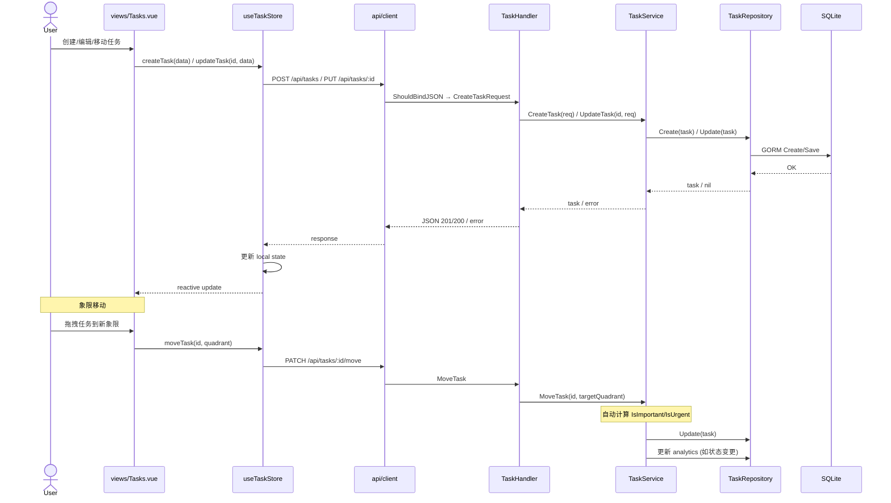

# Flow: Task Lifecycle (任务生命周期)

> 任务从创建到完成/取消的完整生命周期。

## Sequence Diagram



## 参与模块

| 模块 | 角色 | 蓝图 |
|------|------|------|
| views/Tasks | UI 入口 | - |
| stores/task | 状态管理 | [stores](../modules/stores.md) |
| api/client | HTTP 通信 | [api-client](../modules/api-client.md) |
| handler/TaskHandler | 请求处理 | [api-handler](../modules/api-handler.md) |
| service/TaskService | 业务逻辑 | [service](../modules/service.md) |
| repository/TaskRepo | 数据持久化 | [repository](../modules/repository.md) |

## 异常路径

| 场景 | 处理方式 |
|------|----------|
| 任务不存在 | Repo 返回 `ErrNotFound` → Handler 返回 404 |
| 验证失败 (空标题等) | `ShouldBindJSON` 失败 → Handler 返回 400 |
| 并发写冲突 | SQLite 单写入器，GORM 返回错误 → 500 |
| 网络中断 | Store catch error → `ElMessage.error` 提示用户 |

## 状态流转

```
todo → in_progress → completed
                   → cancelled
```
