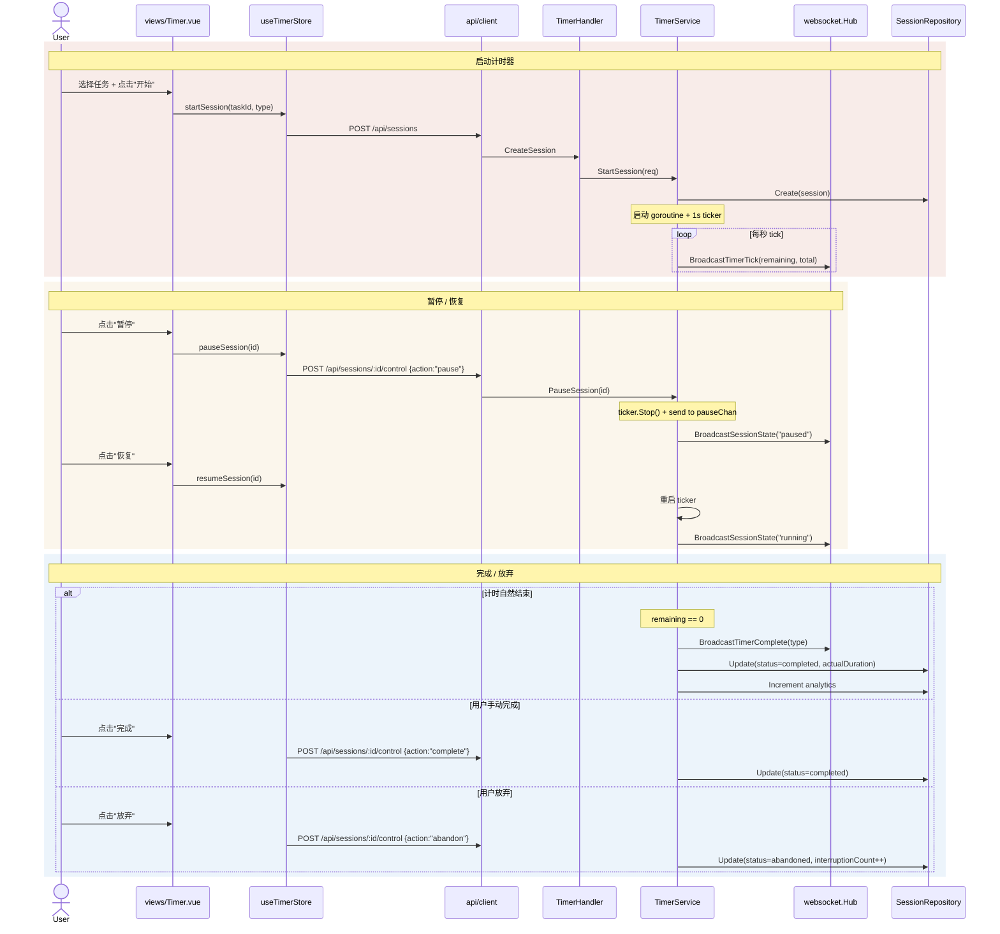

# Flow: Timer Session (计时器会话)

> 番茄钟计时器的完整生命周期：启动 → 倒计时 → 暂停/恢复 → 完成/放弃。

## Sequence Diagram

## 参与模块

| 模块 | 角色 | 蓝图 |
|------|------|------|
| views/Timer | UI 入口 | - |
| stores/timer | 状态管理 (REST + WS 双路径) | [stores](../modules/stores.md) |
| api/client | REST 通信 | [api-client](../modules/api-client.md) |
| handler/TimerHandler | 请求处理 | [api-handler](../modules/api-handler.md) |
| service/TimerService | goroutine 计时 + 广播 | [service](../modules/service.md) |
| websocket/Hub | 实时推送 | [websocket](../modules/websocket.md) |

## 关键设计

- **goroutine 计时**：`startTimer()` 启动独立 goroutine，通过 channel 控制生命周期
- **双路径更新**：REST 获取初始状态，WebSocket 接收实时 tick
- **慢客户端保护**：Hub 非阻塞 send，缓冲区满时断开客户端

## 异常路径

| 场景 | 处理方式 |
|------|----------|
| 已有活跃会话 | `GetActive()` 返回现有会话 → 前端恢复状态 |
| WebSocket 断开 | 前端自动重连 + 回退到 REST 轮询 |
| 后端重启 | goroutine 丢失 → 前端通过 REST 恢复最后状态 |
| 会话不存在 | `ErrNotFound` → Handler 返回 404 |

## 关联

| 类型 | 链接 |
|------|------|
| 关联流程 | [WebSocket Real-time](websocket-realtime.md) |
| 关联 ADR | [ADR-0003](../decisions/adr-0003-websocket-realtime.md) |
