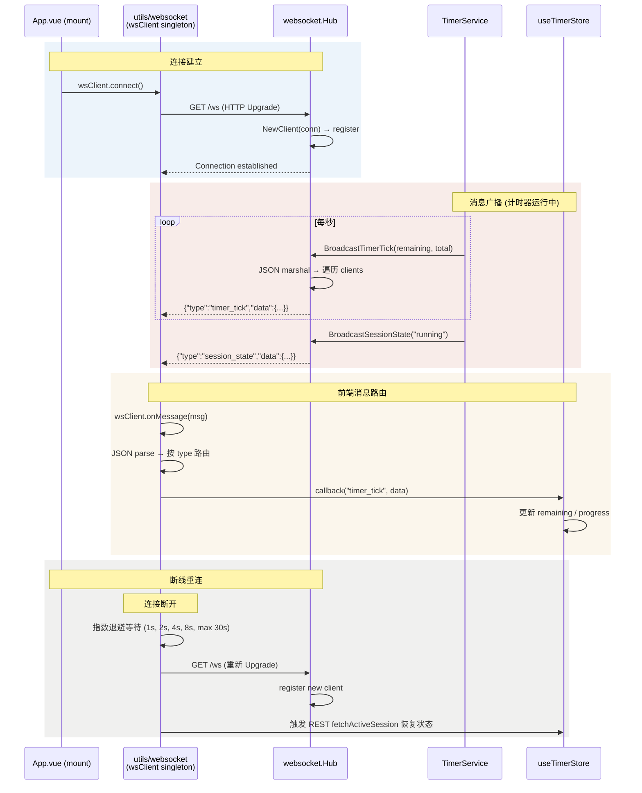

# Flow: WebSocket Real-time Updates (实时更新)

> WebSocket 连接建立、消息广播和自动重连的完整流程。

## Sequence Diagram

## 消息类型

| type | 触发时机 | 数据字段 |
|------|----------|----------|
| `timer_tick` | 每秒 (计时器运行中) | `remaining`, `total` |
| `session_state` | 暂停/恢复/开始 | `state` (running/paused/completed) |
| `timer_complete` | 计时自然结束 | `sessionType` (work/short_break/long_break) |
| `task_updated` | 任务状态变更 | `task` (完整 Task 对象) |
| `terminal_output` | 终端输出流 | `chunk`, `isStderr` |
| `terminal_status` | 终端状态 | `status`, `message` |

## 参与模块

| 模块 | 角色 | 蓝图 |
|------|------|------|
| App.vue | 连接初始化 | - |
| utils/websocket | 客户端单例 | - |
| websocket/Hub | 服务端 Hub | [websocket](../modules/websocket.md) |
| stores/timer | 消费 tick 消息 | [stores](../modules/stores.md) |

## 关键设计

- **单例连接**：`wsClient` 在 App.vue 的 `onMounted` 中初始化一次
- **类型化路由**：消息按 `type` 字段分发给对应 callback
- **指数退避重连**：1s → 2s → 4s → 8s → ... → 30s max
- **慢客户端驱逐**：Hub 端非阻塞 send，缓冲满则断开

## 异常路径

| 场景 | 处理方式 |
|------|----------|
| 后端重启 | WebSocket 断开 → 前端自动重连 → REST 恢复状态 |
| 网络波动 | 指数退避重连 |
| 消息解析失败 | console.error + 丢弃消息 |
| 多 Tab 打开 | 每个 Tab 独立 WebSocket 连接，Hub 广播到所有 |

## 关联

| 类型 | 链接 |
|------|------|
| 关联模块 | [websocket](../modules/websocket.md), [stores](../modules/stores.md) |
| 关联流程 | [Timer Session](timer-session.md) |
| 关联 ADR | [ADR-0003](../decisions/adr-0003-websocket-realtime.md) |
