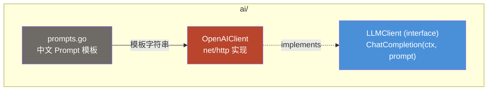

# Module: ai (AI 集成层)

> OpenAI 兼容的 LLM 客户端抽象，提供 Chat Completion 能力。

## Component Diagram



## 对外接口

| 接口 | 方法 | 说明 |
|------|------|------|
| `LLMClient` | `ChatCompletion(ctx context.Context, prompt string) (string, error)` | 唯一公开方法，发送 prompt 并返回 LLM 响应 |

## 构造函数

```
NewOpenAIClient(apiKey, baseURL, model string) *OpenAIClient
```
- 默认模型：GPT-4o-mini
- 默认超时：30 秒
- 可通过环境变量 `TT_AI_API_KEY` 覆盖 API Key

## Prompt 模板

| 函数 | 用途 | 输出格式 |
|------|------|----------|
| 分类 prompt | 任务自动分类到象限 | JSON `{quadrant, isImportant, isUrgent}` |
| 排程 prompt | 生成每日日程 | JSON `{events: [{title, start, end, type}]}` |
| 优先级 prompt | 任务优先级排序 | JSON `{suggestions: [{taskId, priority, reason}]}` |

所有 prompt 明确要求 "只返回 JSON，不要包含任何其他文字"。

## 关键设计

- `LLMClient` 为接口，支持测试中 mock 替换
- 响应解析在 `service/ai_service.go` 的 `extractJSON()` 中处理 markdown code fence
- 配置来自 `pkg/config` 的 `AIConfig` 结构

## 关联

| 类型 | 链接 |
|------|------|
| 依赖 | Go 标准库 (`net/http`, `encoding/json`, `context`) |
| 消费模块 | [service](service.md) (通过 `LLMClient` 接口注入) |
| 关联流程 | [AI Schedule Generation](../flows/ai-schedule-generation.md) |
| 关联 ADR | [ADR-0004](../decisions/adr-0004-openai-compatible-ai.md) |
