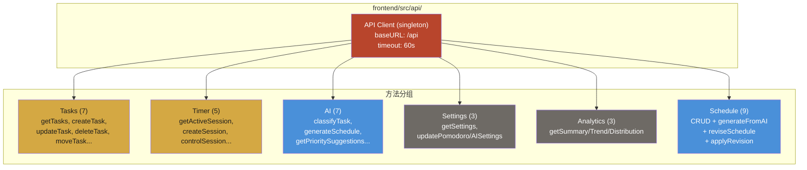

# Module: api/client (Axios HTTP 客户端)

> 前端 Axios 单例客户端，提供全后端 API 的类型化调用方法。

## Component Diagram

## 对外接口

| 分组 | 方法数 | 超时覆盖 | 说明 |
|------|--------|----------|------|
| Tasks | 7 | 默认 60s | 标准 CRUD + 象限分组 + 移动 |
| Timer | 5 | 默认 60s | 会话创建 + 控制 + 统计 |
| AI | 7 | 默认 60s | 分类、排程、优先级、洞察 |
| Settings | 3 | 默认 60s | 番茄钟设置 + AI 设置 |
| Analytics | 3 | 默认 60s | 汇总、趋势、分布 |
| Schedule | 9 | `generateFromAI`/`reviseSchedule` = 360s | CRUD + AI 生成 + 修订 + 应用 |

## 关键设计

- 所有方法返回类型化 Axios 响应：`client.get<Task[]>('/tasks')`
- Vite 开发模式代理 `/api` -> `:8080`
- 长时 AI 请求（日程生成/修订）使用 360 秒超时
- 最小拦截器：仅 console.error 日志
- 共存测试文件：`client.test.ts`

## 关联

| 类型 | 链接 |
|------|------|
| 依赖 | axios, `types/` |
| 消费模块 | [stores](stores.md) (所有 Store 直接导入) |
| 关联流程 | 所有流程均经由 API Client |
