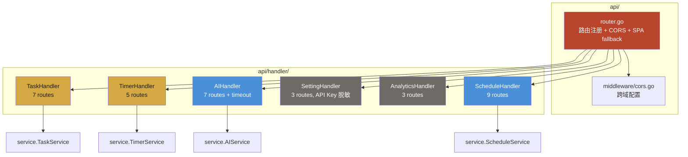

# Module: api/handler (HTTP 传输层)

> Gin HTTP Handler 层，薄层设计：解析输入 -> 委托 Service -> 返回 JSON。

## Component Diagram

## 路由表

| 方法 | 路径 | Handler | 说明 |
|------|------|---------|------|
| GET | `/api/tasks` | TaskHandler.GetTasks | 获取所有任务 |
| GET | `/api/tasks/quadrant` | TaskHandler.GetByQuadrant | 按象限分组 |
| POST | `/api/tasks` | TaskHandler.Create | 创建任务 |
| PUT | `/api/tasks/:id` | TaskHandler.Update | 更新任务 |
| DELETE | `/api/tasks/:id` | TaskHandler.Delete | 删除任务 |
| PATCH | `/api/tasks/:id/move` | TaskHandler.Move | 移动象限 |
| POST | `/api/sessions` | TimerHandler.Create | 创建计时会话 |
| POST | `/api/ai/classify` | AIHandler.Classify | AI 分类 (30s) |
| POST | `/api/ai/schedule` | AIHandler.GenerateSchedule | AI 排程 (60s) |
| POST | `/api/schedules/generate` | ScheduleHandler.GenerateFromAI | AI 生成日程 (360s) |
| POST | `/api/schedules/revise` | ScheduleHandler.Revise | AI 修订日程 (360s) |
| GET | `/ws` | Hub.WebSocketHandler | WebSocket 升级 |

## HTTP 状态码映射

| Service 错误 | HTTP 状态码 |
|-------------|------------|
| 验证失败 | 400 |
| 记录不存在 | 404 |
| 内部错误 | 500 |
| AI 未配置 | 503 |

## 关联

| 类型 | 链接 |
|------|------|
| 依赖 | [service](service.md), [websocket](websocket.md) |
| 消费模块 | `cmd/server/main.go` (路由注册) |
| 关联流程 | [Task Lifecycle](../flows/task-lifecycle.md), [AI Schedule](../flows/ai-schedule-generation.md) |
