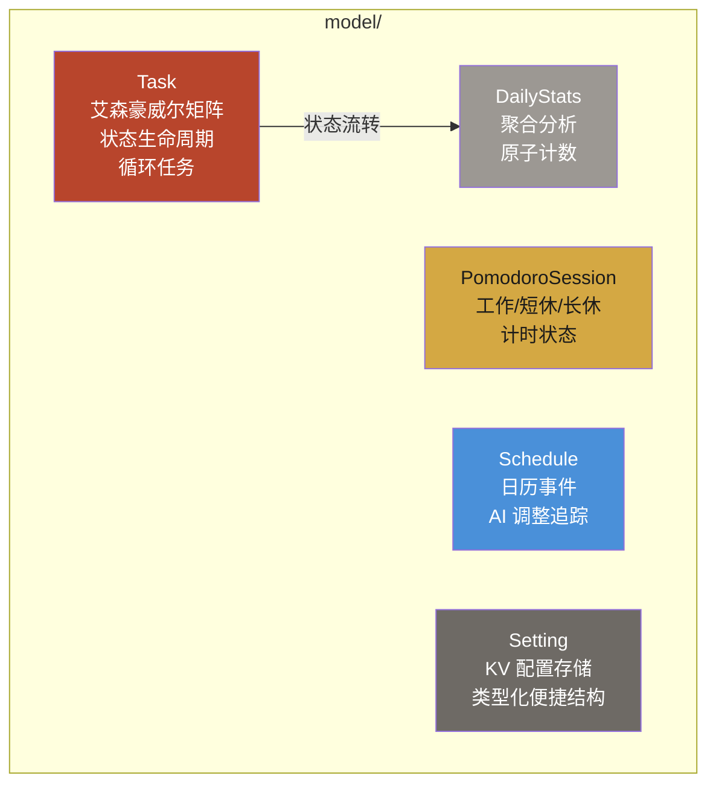

# Module: model (领域模型)

> GORM 实体模型，定义数据库 schema 和核心领域类型。

## Component Diagram

## 核心类型

| 模型 | 表名 | 关键字段 |
|------|------|----------|
| Task | `tasks` | Quadrant (1-4), IsImportant, IsUrgent, Status (todo/in_progress/completed/cancelled), IsRecurring, PreferredStartTime/EndTime, Tags (JSON) |
| PomodoroSession | `pomodoro_sessions` | Type (work/short_break/long_break), Status (running/paused/completed), PlannedDuration, ActualDuration, InterruptionCount |
| Schedule | `schedules` | StartTime, EndTime, Type (task/pomodoro/break/custom), Color, AIAdjusted, AdjustmentType |
| Setting | `settings` | Key (string), Value (JSON string), 含 PomodoroSettings/AISettings 便捷结构 |
| DailyStats | `daily_stats` | Date, CompletedPomodoros, TotalFocusMinutes, TasksCompleted, TasksCreated |

## 关键设计

- 所有模型定义 `TableName()` 方法显式指定表名
- 指针字段表示可空值（`*time.Time`, `*string`）
- 枚举类型使用自定义 string 常量
- Tags 存储为 JSON 字符串
- 工厂函数：`DefaultPomodoroSettings()`, `DefaultAISettings()`

## 关联

| 类型 | 链接 |
|------|------|
| 依赖 | GORM (仅 struct tags) |
| 消费模块 | [repository](repository.md), [service](service.md), [api-handler](api-handler.md) |
| 关联流程 | [Task Lifecycle](../flows/task-lifecycle.md) |
