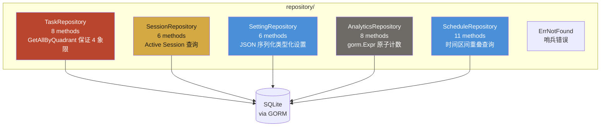

# Module: repository (数据访问层)

> 通过 GORM 实现的 SQLite 数据访问层，每个仓储遵循 interface + private struct 模式。

## Component Diagram

## 对外接口

| 仓储 | 关键方法 | 说明 |
|------|----------|------|
| TaskRepository | GetAll, GetAllByQuadrant, GetByID, Create, Update, Delete, Move | `GetAllByQuadrant` 保证返回全部 4 个象限 |
| SessionRepository | GetActive, GetRecent, Create, Update, Delete | `GetActive` 查询 `status IN (running, paused)` |
| SettingRepository | GetByKey, GetAll, Upsert, Delete | JSON marshal/unmarshal 内部处理 |
| AnalyticsRepository | GetDailyStats, IncrementCompleted, IncrementFocusTime | `gorm.Expr("column + ?", n)` 原子更新 |
| ScheduleRepository | GetByTimeRange, Create, Update, Delete, DeleteByDateRange | 3 条件 OR 查询处理时间区间重叠 |

## 关键设计

- 所有构造函数返回**接口类型**，不暴露具体实现
- 统一 `ErrNotFound` 哨兵错误，上层通过 `errors.Is()` 判断
- GORM 错误直接传播（不 wrapping）
- 测试中使用 in-memory `map[string]*Model` 实现 mock 接口

## 关联

| 类型 | 链接 |
|------|------|
| 依赖 | [model](model.md), GORM |
| 消费模块 | [service](service.md) |
| 关联 ADR | [ADR-0001](../decisions/adr-0001-sqlite-as-db.md) |
