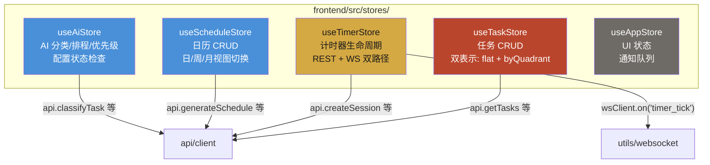

# Module: stores (Pinia 状态管理)

> 前端 Pinia 状态管理层，Composition API 模式，直接调用 API 客户端。

## Component Diagram

## 对外接口

| Store | 关键 State | 关键 Actions |
|-------|-----------|--------------|
| useTaskStore | `tasks`, `tasksByQuadrant`, `loading` | `fetchTasks`, `createTask`, `updateTask`, `deleteTask`, `moveTask` |
| useTimerStore | `activeSession`, `timerState`, `remaining` | `startSession`, `pauseSession`, `resumeSession`, `setupWebSocket` |
| useScheduleStore | `schedules`, `currentDate`, `viewMode` | `fetchSchedules`, `generateFromAI`, `reviseSchedule`, `applyRevision` |
| useAiStore | `aiStatus`, `loading` | `classifyTask`, `generateSchedule`, `checkConfig` |
| useAppStore | `currentView`, `sidebarOpen`, `notifications` | `addNotification`, `toggleSidebar` |

## 关键设计

- 所有 state 使用 `ref()`，不使用 `reactive()`
- 异步 action 遵循 `try/catch/finally` + `loading` flag 模式
- **TimerStore** 双路径更新：REST 获取初始状态，WebSocket 接收实时推送
- Store 直接调用 API 客户端，无中间 service 层
- 测试中每个 `beforeEach` 必须 `setActivePinia(createPinia())`

## 关联

| 类型 | 链接 |
|------|------|
| 依赖 | [api-client](api-client.md), `types/`, `utils/websocket` |
| 消费模块 | `views/`, `components/`, `App.vue` |
| 关联流程 | [Task Lifecycle](../flows/task-lifecycle.md), [Timer Session](../flows/timer-session.md), [AI Schedule](../flows/ai-schedule-generation.md) |
