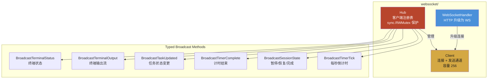

# Module: websocket (实时通信层)

> 基于 gorilla/websocket 的 Hub+Client 模式，为前端提供实时计时器状态推送。

## Component Diagram



## 对外接口

| 组件 | 方法 | 说明 |
|------|------|------|
| Hub | `NewHub()` | 创建 Hub 实例 |
| Hub | `Run()` | 启动 Hub goroutine |
| Hub | `WebSocketHandler(c *gin.Context)` | HTTP -> WS 升级 |
| Hub | `BroadcastTimerTick(remaining, total)` | 计时器 tick |
| Hub | `BroadcastSessionState(state)` | 会话状态变更 |
| Hub | `BroadcastTimerComplete(sessionType)` | 计时完成 |
| Hub | `BroadcastTaskUpdated(task)` | 任务更新通知 |

## 关键设计

- **慢客户端驱逐**：非阻塞 send，缓冲区满时自动断开
  ```go
  select {
  case client.send <- msg:
  default:
      hub.unregister <- client  // 驱逐慢客户端
  }
  ```
- **读泵 (readPump)**：排空入站消息，当前无应用层处理
- **写泵 (writePump)**：从发送通道写入 WebSocket
- **CheckOrigin** 返回 true（本地单用户部署，无跨域限制）

## 关联

| 类型 | 链接 |
|------|------|
| 依赖 | gorilla/websocket |
| 消费模块 | [service](service.md) (TimerService 调用 Broadcast), [api-handler](api-handler.md) (注册 /ws) |
| 关联流程 | [Timer Session](../flows/timer-session.md), [WebSocket Real-time](../flows/websocket-realtime.md) |
| 关联 ADR | [ADR-0003](../decisions/adr-0003-websocket-realtime.md) |
