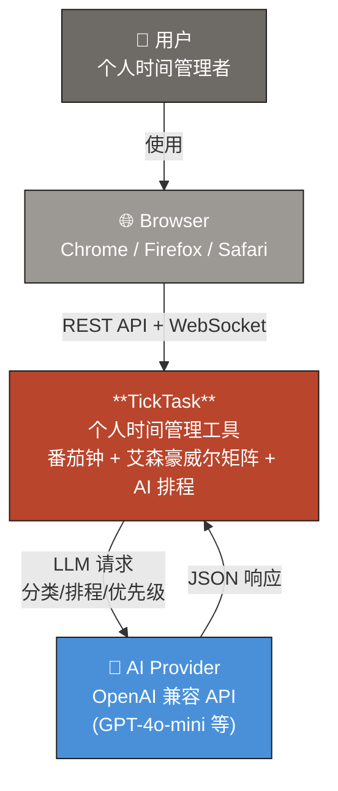

# System Context (C4 Level 1)

TickTask 系统与外部角色和外部系统的交互关系。

## 外部角色

| 角色 | 类型 | 交互方式 | 说明 |
|------|------|----------|------|
| User | 人员 | 通过浏览器操作 | 个人用户，使用番茄钟、任务管理、AI 排程等功能 |
| AI Provider | 外部系统 | HTTPS REST API (OpenAI 兼容) | 提供 LLM 能力：任务分类、日程生成、优先级排序 |
| Browser | 外部系统 | HTTP + WebSocket | 承载 Vue 3 SPA，通过 REST 和 WebSocket 与后端通信 |

## 核心系统

**TickTask** — 全栈 Web 应用，提供任务管理（艾森豪威尔四象限）、番茄钟计时、AI 智能排程、日程管理、数据分析等功能。

## 关键交互

| 从 | 到 | 协议 | 描述 |
|----|----|------|------|
| User | Browser | UI 操作 | 用户通过浏览器界面管理任务、启动计时器、查看分析 |
| Browser | TickTask 后端 | HTTP REST | CRUD 操作、AI 请求、设置管理 |
| Browser | TickTask 后端 | WebSocket | 实时计时器状态推送（1 秒 tick） |
| TickTask 后端 | AI Provider | HTTPS POST | 发送 prompt，接收 JSON 格式的分类/排程/优先级结果 |

## 系统边界

- TickTask 为单用户本地部署应用，无认证层
- AI Provider 为可选依赖（未配置 API Key 时 AI 功能降级）
- 所有数据存储在本地 SQLite 文件中
