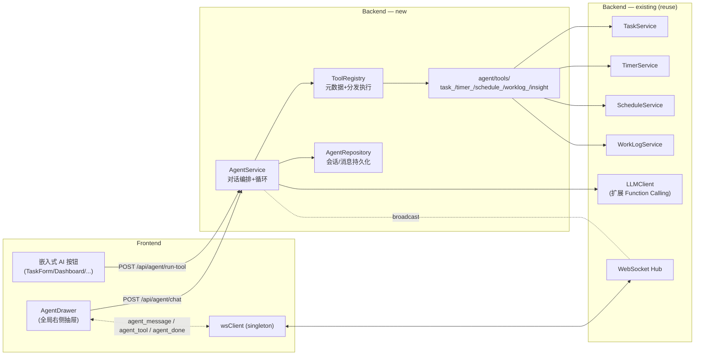
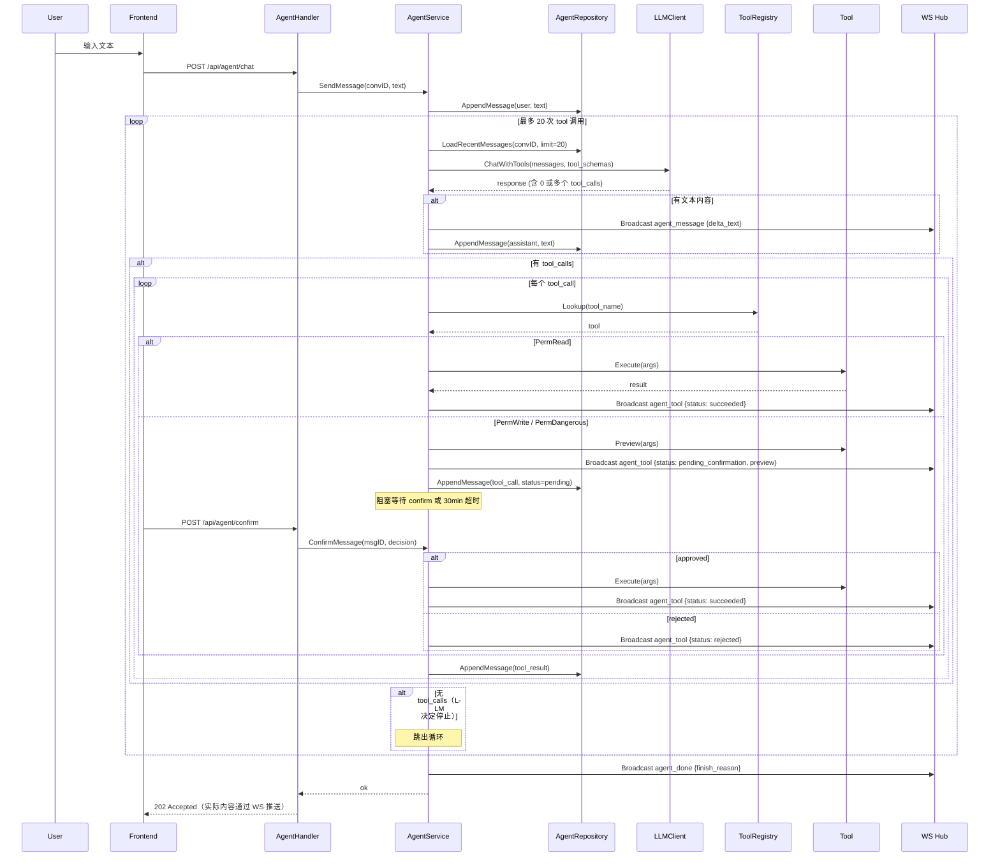

# Agent Entry — AI 智能助手入口设计

> 日期：2026-08-08
> 状态：Draft（待用户审查 → 转 writing-plans）
> Mockup：[`agent-mockup.html`](./agent-mockup.html)（浏览器打开可看 6 个交互场景）

## 1. 概述

### 1.1 目标

为 TickTask 增加**对话型 AI Agent 入口**，让用户通过自然语言一句话控制和处理多个业务能力（任务、番茄钟、日程、工作日志、洞察）。Agent 基于 OpenAI Function Calling / Anthropic Tool Use，能自主编排多个能力完成任务。

定位参考业界做法（M365 Copilot / Apple Siri 2024+ with App Intents / 飞书智能伙伴）。

### 1.2 范围（MVP）

- 全局右侧抽屉作为 Agent 入口（480px，从右侧滑入；最小化为右侧窄边栏归 v1.2）
- 对话型 LLM + Function Calling，**彻底取代**现有 `AIService`，所有 AI 能力以 tool 形式注册
- 13 个 tool：任务 5 + 番茄钟 3 + 日程 2 + 工作日志 2 + 洞察 1
- 三级权限模型：PermRead（自主执行）/ PermWrite（确认执行）/ PermDangerous（二次确认）
- 对话历史持久化（SQLite，关闭浏览器后保留）
- 配置热加载顺便修复（现有 `AIService` 启动绑定问题）

### 1.3 非目标（不在 MVP）

- 周期报告 tool（周/月/半年/年报）—— v1.1
- 日程修订 tool（接入既有 `ReviseSchedule`）—— v1.1
- 抽屉宽度可拖拽、tool 卡片默认折叠、Ctrl+/ 唤起 —— v1.2
- 上下文感知（抽屉感知当前页选中任务）—— v2
- 跨设备同步（单机部署不需要）

### 1.4 关键决策摘要

| 决策 | 选项 | 理由 |
|---|---|---|
| Agent 形态 | 对话型 + Function Calling | 业界主流，跨能力编排价值最高 |
| UI 形态 | 全局右侧抽屉 | 任意页可唤起，可拿当前页上下文，长任务展开半屏 |
| 取代 AIService 力度 | 彻底取代 | 架构最统一，所有 AI 调用走同一套客户端/配置/日志 |
| 权限模型 | Trust Levels 三级 | 读类自主、写类确认、危险二次确认（业界主流） |
| 对话历史 | 持久化到 SQLite | 关闭浏览器/重启进程不丢上下文 |

---

## 2. 架构总览

### 2.1 组件依赖图



### 2.2 关键设计决策

**两条入口、一套 tools**：
- `/api/agent/chat` —— 对话模式，多轮，流式，写消息历史
- `/api/agent/run-tool` —— 无头模式，单 tool，同步，不写历史（嵌入式按钮用）

**Agent 与既有业务 service 解耦**：
Tools 是薄壳，业务逻辑保留在 `TaskService`/`TimerService`/.../里。Tools 只负责：参数校验、JSON 序列化、调用 service、把结果包装成 tool_result。

**复用 WebSocket Hub**：
现有 `terminal_output`/`terminal_status` 仍为 `ReviseSchedule` 服务；Agent 新增三类独立事件（`agent_message`/`agent_tool`/`agent_done`），不复用旧事件类型。

**配置热加载顺便修**：
现有 `AIService` 在 `main.go` 启动时绑定 LLM 客户端，更新设置后不生效。新 `AgentService` 每次调用前从 `settingRepository` 取最新配置，按需构造客户端。同时为既有 `AIService`（如果 v1.1 才彻底删除）做同样的热加载修复。

---

## 3. 后端设计

### 3.1 文件清单

#### 新增

| 文件 | 职责 |
|---|---|
| `backend/internal/agent/service.go` | `AgentService`：管理对话循环、调 LLM、解析 tool_call、执行 tool、流式推送 |
| `backend/internal/agent/registry.go` | `ToolRegistry`：注册/查表/分发 tool |
| `backend/internal/agent/tool.go` | `Tool` 接口、`ToolSchema`、`ToolPermission` 常量 |
| `backend/internal/agent/conversation.go` | 对话上下文构建：从 repo 读历史 → 拼成 LLM 消息序列 |
| `backend/internal/agent/limits.go` | 边界常量：`MaxToolCallsPerTurn=20`、`MaxContextMessages=20`、`ConfirmationTimeout=30min` |
| `backend/internal/agent/tools/task_crud.go` | `list_tasks`/`create_task`/`update_task`/`delete_task` |
| `backend/internal/agent/tools/task_classify.go` | `classify_task`（含 `classify_task_by_text` 同义合并） |
| `backend/internal/agent/tools/timer.go` | `start_pomodoro`/`stop_pomodoro`/`get_timer_status` |
| `backend/internal/agent/tools/schedule.go` | `generate_schedule`/`list_schedule` |
| `backend/internal/agent/tools/worklog.go` | `structure_worklog`/`save_worklog` |
| `backend/internal/agent/tools/insight.go` | `get_daily_insights` |
| `backend/internal/agent/prompts.go` | Agent 系统 prompt（声明可用工具、确认机制、回答风格） |
| `backend/internal/repository/agent_repo.go` | `AgentRepository` 接口 + GORM 实现 |
| `backend/internal/api/handler/agent_handler.go` | HTTP：`POST /chat`、`POST /run-tool`、`POST /confirm`、conversations CRUD |
| `backend/internal/model/agent.go` | `AgentConversation`、`AgentMessage` 领域模型 |

#### 删除

| 文件 | 原因 |
|---|---|
| `backend/internal/service/ai_service.go` | 整个迁移到 `agent/tools/` 与 `agent/service.go` |
| `backend/internal/service/work_log_ai_client.go` | 迁移到 `agent/tools/worklog.go` |
| `backend/internal/api/handler/ai_handler.go` | `/api/ai/*` 路由废弃 |
| `backend/internal/ai/prompts.go` | 各 prompt 迁到对应 tool 文件 |
| `backend/internal/ai/work_log_prompts.go` | 同上 |

#### 扩展

| 文件 | 改动 |
|---|---|
| `backend/internal/ai/client.go` | `LLMClient` 接口加 `ChatWithTools(ctx, messages, tools) (response, error)`；三个实现（OpenAI/Anthropic/CLI）各自适配 |
| `backend/cmd/server/main.go` | 装配 `AgentService` + `ToolRegistry`，注入依赖；删除 `AIService` 装配 |
| `backend/internal/api/router.go` | 注册 `/api/agent/*` 路由组；删除 `/api/ai/*` |
| `backend/internal/websocket/hub.go` | 加 `agent_message`/`agent_tool`/`agent_done` 三个事件常量 |
| `backend/pkg/database/seed.go` | （无需 schema 迁移；GORM AutoMigration 自动建 agent_conversations / agent_messages） |

### 3.2 Tool 接口与权限模型

```go
// backend/internal/agent/tool.go
package agent

type ToolPermission int
const (
    PermRead ToolPermission = iota      // 自主执行
    PermWrite                            // 需用户确认
    PermDangerous                        // 二次确认（红色弹窗）
)

type ToolSchema struct {
    Name        string
    Description string
    Parameters  map[string]any           // JSON Schema（OpenAI tools API 格式）
    Permission  ToolPermission
}

type Tool interface {
    Schema() ToolSchema
    Execute(ctx context.Context, args json.RawMessage) (result any, err error)
    Preview(ctx context.Context, args json.RawMessage) (any, error)  // PermWrite/Dangerous 必填
}
```

`ToolRegistry` 持有 `map[string]Tool`，启动时由 `agent/tools.RegisterAll(reg, deps)` 一次性注入所有依赖（TaskSvc、TimerSvc 等）。

### 3.3 AgentService 对话循环（时序）



### 3.4 LLMClient 扩展（Function Calling）

新增接口方法（不破坏既有 `ChatCompletion`）：

```go
type Message struct {
    Role       string           // user | assistant | system | tool
    Content    string
    ToolCalls  []ToolCall       // assistant 发起
    ToolCallID string           // tool 角色消息关联
    Name       string           // tool 角色消息的工具名
}

type ToolCall struct {
    ID   string
    Name string
    Args json.RawMessage
}

type ToolSpec struct {
    Type       string
    Function   struct {
        Name        string
        Description string
        Parameters  map[string]any  // JSON Schema
    }
}

type ToolResponse struct {
    Content    string         // LLM 文本（可能为空）
    ToolCalls  []ToolCall     // 要求执行的 tool 列表
    FinishReason string       // stop | tool_calls | length
}

ChatWithTools(ctx context.Context, messages []Message, tools []ToolSpec) (ToolResponse, error)
```

三个实现：
- `OpenAIClient.ChatWithTools` —— OpenAI 兼容 `/v1/chat/completions`，原生 tools API
- `AnthropicClient.ChatWithTools` —— Anthropic Messages API，原生 tool_use
- `CLIClient.ChatWithTools` —— **返回 `ErrFunctionCallNotSupported`**；AgentService 上层判断 provider==cli 时禁用入口

---

## 4. 前端设计

### 4.1 新增组件

| 文件 | 职责 |
|---|---|
| `frontend/src/components/agent/AgentDrawer.vue` | 抽屉容器（`<el-drawer>`），含 header / 消息区 / 输入区 / 历史切换 |
| `frontend/src/components/agent/AgentMessageList.vue` | 渲染消息流（user / assistant / tool_call / tool_result） |
| `frontend/src/components/agent/AgentInput.vue` | 多行输入 + 发送 + 快捷指令 |
| `frontend/src/components/agent/ToolCard.vue` | tool_call 卡片（按权限/状态着色） |
| `frontend/src/components/agent/ToolConfirmDialog.vue` | PermDangerous 二次确认弹窗 |
| `frontend/src/components/agent/ConversationList.vue` | 历史会话列表（顶部 toggle 展开） |

### 4.2 stores/agent.ts 状态机

```typescript
state:
  isOpen: boolean
  conversations: AgentConversation[]
  currentConvId: string | null
  messages: AgentMessage[]
  streamingText: string          // LLM 增量 token 拼接
  pendingConfirm: PendingToolCall | null
  isThinking: boolean

actions:
  openDrawer() / closeDrawer() / toggleDrawer()
  checkStatus(): {configured, supports_function_calling}    // 替代原 ai.checkStatus
  listConversations() / createConversation() / switchConversation(id) / deleteConversation(id)
  sendMessage(text: string)
  runTool(name: string, args: object): Promise<ToolResult>   // 无头模式
  confirmToolCall(messageId: string, decision: 'approve' | 'reject')
  handleWsEvent(event: AgentWsEvent)                          // 分发到下面三个
    - onAgentMessage(delta)
    - onAgentTool(message)
    - onAgentDone(finishReason)
  clearCurrentConversation()
```

### 4.3 嵌入式 AI 按钮改造

```typescript
// 旧：
const ai = useAiStore()
await ai.classifyTask(id)

// 新：
const agent = useAgentStore()
await agent.runTool('classify_task', { task_id: id })
```

`stores/ai.ts` **删除**，5 个调用点（`TaskForm.vue` / `TaskCard.vue` / `Dashboard.vue` / `Analytics.vue` / 部分 `Schedule.vue`）改为 `useAgentStore().runTool(...)`，UI 不变。

### 4.4 全局挂载

在 `App.vue` 末尾挂 `<AgentDrawer />`，header 顶部加 Agent 图标按钮唤起。

### 4.5 UI 视觉参考

详见 [`agent-mockup.html`](./agent-mockup.html)。要点：
- 抽屉宽 480px，背景白色，左侧 8px 阴影
- 消息气泡：user（蓝色右对齐）/ assistant（浅灰左对齐）
- tool 卡片按权限着色左边框：Read 绿、Write 黄、Dangerous 红
- 流式输出：typing indicator（三个闪烁点）
- 历史会话视图：抽屉顶部"历史 ▾" toggle 切换

---

## 5. 数据模型 + API + WebSocket

### 5.1 GORM Model

```go
// backend/internal/model/agent.go
type AgentConversation struct {
    ID           string    `gorm:"primaryKey;type:text" json:"id"`           // UUID
    Title        string    `gorm:"size:200" json:"title"`
    CreatedAt    time.Time `json:"created_at"`
    UpdatedAt    time.Time `json:"updated_at"`
    MessageCount int       `json:"message_count"`
}

type AgentMessage struct {
    ID             string    `gorm:"primaryKey;type:text" json:"id"`         // UUID
    ConversationID string    `gorm:"index;type:text" json:"conversation_id"`
    Role           string    `gorm:"size:20" json:"role"`                    // user|assistant|tool_call|tool_result
    Content        string    `gorm:"type:text" json:"content"`
    ToolName       *string   `gorm:"size:50" json:"tool_name,omitempty"`
    ToolArgs       *string   `gorm:"type:text" json:"tool_args,omitempty"`   // JSON
    ToolResult     *string   `gorm:"type:text" json:"tool_result,omitempty"` // JSON
    ToolStatus     *string   `gorm:"size:30" json:"tool_status,omitempty"`   // started|pending_confirmation|succeeded|failed|rejected
    ParentID       *string   `gorm:"type:text" json:"parent_id,omitempty"`   // tool_result 关联到 tool_call
    CreatedAt      time.Time `json:"created_at"`
}
```

GORM AutoMigration 在 `pkg/database/database.go` 里加这两个 model 到 `AutoMigrate` 列表。

### 5.2 REST API

| 方法 | 路径 | 入参 | 出参 |
|---|---|---|---|
| POST | `/api/agent/conversations` | – | `{id, title, created_at}` |
| GET | `/api/agent/conversations?page=1&size=20` | – | `{items: [...], total}` |
| GET | `/api/agent/conversations/:id/messages` | – | `AgentMessage[]` |
| DELETE | `/api/agent/conversations/:id` | – | 204 |
| POST | `/api/agent/chat` | `{conversation_id, text}` | 202 Accepted（结果走 WS） |
| POST | `/api/agent/run-tool` | `{tool, args}` | `{result}` 或 `{error}` |
| POST | `/api/agent/confirm` | `{message_id, decision}` | 200 |
| GET | `/api/agent/status` | – | `{configured: bool, supports_function_calling: bool, provider: string}` |

### 5.3 WebSocket 事件

| 事件 | 方向 | 字段 |
|---|---|---|
| `agent_message` | S→C | `{conversation_id, message_id, delta_text}` |
| `agent_tool` | S→C | `{conversation_id, message_id, tool_name, args, status, preview?, result?, error?}` |
| `agent_done` | S→C | `{conversation_id, finish_reason, total_tokens}` |

`status` 取值：`started` / `pending_confirmation` / `succeeded` / `failed` / `rejected`

---

## 6. MVP Tool 清单（13 个）

| Tool | 权限 | 关键参数 | 复用 | 备注 |
|---|---|---|---|---|
| `list_tasks` | Read | `status?`, `due?`, `quadrant?` | `TaskService.List` | – |
| `create_task` | Write | `title`, `description?`, `priority?`, `due?` | `TaskService.Create` | – |
| `update_task` | Write | `task_id`, 可变字段 | `TaskService.Update` | – |
| `delete_task` | Dangerous | `task_id` | `TaskService.Delete` | 单个删除即危险级 |
| `classify_task` | Read | `task_id` 或 `title+description` | 原 `AIService.ClassifyTask[ByText]` | 合并两个原方法 |
| `start_pomodoro` | Write | `task_id?`, `duration_min?` | `TimerService.Start` | – |
| `stop_pomodoro` | Write | – | `TimerService.Stop` | – |
| `get_timer_status` | Read | – | `TimerService.GetStatus` | – |
| `generate_schedule` | Write | `date?`, `pomodoro_settings?` | 原 `AIService.GenerateDailySchedule` | – |
| `list_schedule` | Read | `from`, `to` | `ScheduleService.List` | – |
| `structure_worklog` | Read | `brain_dump` | 原 `WorkLogAIClient.StructureBrainDump` | – |
| `save_worklog` | Write | `items[]`, `date` | `WorkLogService.Save` | – |
| `get_daily_insights` | Read | `date` | 原 `AIService.GetDailyInsights` | – |

---

## 7. 错误处理、边界、降级

### 7.1 错误处理

| 场景 | 处理 |
|---|---|
| LLM 调用失败 | 发 `agent_done {finish_reason: "error"}`，前端显示"AI 暂不可用"，会话状态保持，输入框允许重试 |
| tool 执行失败 | 发 `agent_tool {status: "failed", error}`，错误作为 tool_result 喂回 LLM，由 LLM 决定重试/换方案/告知用户 |
| 用户超时未确认（30 分钟） | 自动 `rejected`，LLM 收到后继续对话 |
| WS 断连 | 前端自动重连；已确认的 tool_call 不丢失（持久化在 DB）；未确认的需用户重发 |
| Function Calling 不支持（Provider=cli） | 入口禁用，UI 提示"请切换到 OpenAI/Anthropic provider" |

### 7.2 边界（防 LLM 失控）

| 边界 | 值 | 含义 |
|---|---|---|
| `MaxToolCallsPerTurn` | 20 | 单轮对话最多 20 次 tool 调用，超出强制 `agent_done {finish_reason: "max_tools"}` |
| `MaxContextMessages` | 20 | 送 LLM 的历史窗口 |
| `MaxMessageTokens` | 4000 | 单条消息 token 上限 |
| `ConfirmationTimeout` | 30min | 写操作等待确认超时 |

Tool 参数严格按 JSON Schema 校验，LLM 给错参数 → 返回结构化错误，不进 service 层。

### 7.3 降级

- Provider=`claude`（本地 CLI）→ 入口禁用
- `IsConfigured() == false` → 入口禁用 + "去配置"按钮跳设置页
- LLM 不可达 → "AI 暂不可用"，可手动重试

---

## 8. 测试策略与用例

> 用例 ID 命名规约：`T-<MODULE>-NN`（后端）/ `T-FE-NN`（前端 store）/ `T-COMP-NN`（组件）/ `T-INT-NN`（嵌入式集成）/ `T-API-NN`（HTTP E2E）。

### 8.1 测试基础设施

| 设施 | 用途 | 实现要点 |
|---|---|---|
| `MockLLMClient` | 替换真 LLM，预设 tool_call 序列 | 实现 `LLMClient` 接口；记录每次调用入参；按队列返回 response |
| `MockTaskService` / `MockTimerService` / ... | 单 tool 单测里注入 mock service | 沿用项目既有 mock 模式（in-memory map） |
| In-memory SQLite | `AgentRepository` 集成测 | `gorm.Open(sqlite.Open(":memory:"))` + AutoMigrate |
| `MockWSHub` | 验证 AgentService 广播事件序列 | 实现 `Hub` 接口；记录所有 Broadcast 调用 |
| 前端 WS mock | Vitest `vi.mock('utils/websocket')`，预设事件序列 | 配合 `stores/agent.ts` 单测 |
| 前端 API mock | Vitest `vi.mock('api/client')`，断言调用参数 | 配合 store + 组件单测 |

### 8.2 后端单元测试

#### 8.2.1 ToolRegistry（`registry_test.go`）

| 用例 ID | 描述 | 输入 | 期望 |
|---|---|---|---|
| T-REG-01 | 启动注册全部 13 个 tool | `tools.RegisterAll(reg, deps)` | `len(reg.List()) == 13`，含全部表内名称 |
| T-REG-02 | 按名查存在的 tool | `Lookup("list_tasks")` | 返回 tool 实例，error=nil |
| T-REG-03 | 按名查不存在的 tool | `Lookup("xxx")` | 返回 `ErrToolNotFound` |
| T-REG-04 | OpenAI tools schema 序列化 | `ToOpenAITools()` | JSON 字段含 `type`/`function.name`/`function.description`/`function.parameters` |
| T-REG-05 | 同名 tool 重复注册 | `Register(t1); Register(t2)` 同名 | 返回 `ErrDuplicateTool`（启动期 fail-fast） |
| T-REG-06 | 按权限级别过滤 | `ListByPermission(PermRead)` | 仅返回读类 tool |

#### 8.2.2 各 Tool 单测（每 tool 一个 `*_test.go`）

以 `list_tasks` 为代表（其他 12 个 tool 同模板，每个至少 4-6 个用例）：

| 用例 ID | 描述 | 输入 args | 期望 |
|---|---|---|---|
| T-LT-01 | 无过滤条件 | `{}` | 调 `TaskService.List(empty)`，返回全部 |
| T-LT-02 | status 过滤 | `{"status":"todo"}` | service 收到 `status="todo"` |
| T-LT-03 | due 过滤 | `{"due":"2026-08-08"}` | service 收到 due 日期 |
| T-LT-04 | 多过滤条件组合 | `{"status":"todo","quadrant":1}` | 多字段透传 |
| T-LT-05 | 参数类型错（schema 校验） | `{"due": 12345}` | 返回结构化 schema 错误，**不进 service** |
| T-LT-06 | service 返回空列表 | mock 返回 `[]` | 返回 `{"tasks":[]}`，error=nil |

其他 tool 代表性用例（不再列全）：
- `create_task`：必填字段缺失（schema 错）/ 优先级越界 / 创建成功后返回 task_id
- `update_task`：task_id 不存在（ErrNotFound）/ 部分字段更新 / 仅传 task_id 不变（no-op）
- `delete_task`：Preview 返回"将删除任务 X"（不实际删）/ Execute 后验证 service.Delete 被调
- `classify_task`：传 task_id 路径 / 传 title+desc 路径 / LLM 返回非法 JSON（错误处理）
- `start_pomodoro`：默认 25 分钟 / 自定义时长 / 不绑定 task_id / 当前已有运行中番茄钟（错误）
- `stop_pomodoro`：当前无运行中番茄钟（no-op 或错误）
- `get_timer_status`：运行中 / 已停止
- `generate_schedule`：默认今天 / 指定日期 / 任务列表为空（返回空日程）
- `list_schedule`：from>to（schema 错）/ 范围超 31 天（schema 错）/ 正常返回事件列表
- `structure_worklog`：brain_dump 为空（schema 错）/ LLM 解析失败（重试或返回错误）
- `save_worklog`：items 数组为空 / items 字段缺失 / 保存成功后返回 worklog_id
- `get_daily_insights`：指定日期无数据（返回"无洞察"）

#### 8.2.3 AgentService 编排逻辑（`service_test.go`）

| 用例 ID | 描述 | mock LLM 行为 | 期望 |
|---|---|---|---|
| T-SVC-01 | LLM 直接回答（无 tool_call） | 单次返回 finish=stop + 文本 | 不调 tool；发 1 次 `agent_message` + 1 次 `agent_done{stop}` |
| T-SVC-02 | LLM 单轮调 1 个 PermRead tool | 返回 tool_call=list_tasks，第二次返回 stop | 调 tool 1 次；发 `agent_tool{succeeded}` + 终轮 `agent_message` + `agent_done{stop}` |
| T-SVC-03 | LLM 单轮调多个 tool | 单次返回 [list_tasks, get_timer_status] | 串行执行 2 个；2 次 `agent_tool` |
| T-SVC-04 | PermWrite 用户 approve | mock tool_call=create_task，Confirm(approve) | 先发 `agent_tool{pending_confirmation}`，approve 后执行，发 `agent_tool{succeeded}` |
| T-SVC-05 | PermWrite 用户 reject | 同上但 Confirm(reject) | 发 `agent_tool{rejected}`，工具**未执行**，结果回喂 LLM |
| T-SVC-06 | PermDangerous 双重确认路径 | tool_call=delete_task | 流程同 04 但调用 `tool.Preview` 返回 plan |
| T-SVC-07 | 等待 confirm 超时（30min） | mock + 时间快进 31min | 自动 reject，发 `agent_tool{rejected}`，错误回喂 LLM |
| T-SVC-08 | tool 执行失败 | mock tool.Execute 返回 error | 发 `agent_tool{failed}`，错误作为 tool_result 喂回 LLM |
| T-SVC-09 | 死循环命中 `MaxToolCallsPerTurn=20` | mock 永远返回同 tool_call | 第 21 次拒绝调 LLM，发 `agent_done{max_tools}` |
| T-SVC-10 | LLM 返回不存在的 tool 名 | mock tool_call=unknown_tool | tool_result 喂回 `"tool not found"`，LLM 收到后重试 |
| T-SVC-11 | LLM 参数 schema 不匹配 | mock 返回缺字段 | 同上，结构化 schema 错误回喂 |
| T-SVC-12 | 历史上下文 > 20 条 | DB 预置 25 条消息 | 调 LLM 时 `LoadRecentMessages(conv, 20)` 只传 20 条 |
| T-SVC-13 | LLM 调用本身失败 | mock ChatWithTools 返回 error | 发 `agent_done{error}`，会话状态保持 |
| T-SVC-14 | 会话标题自动生成 | 第一条 user 消息文本超 30 字 | conversation.Title 截断为前 30 字 |
| T-SVC-15 | Provider=cli 不支持 Function Calling | provider==cli | 入口前置检查拒绝（在 handler 层） |
| T-SVC-16 | WS Hub 广播事件顺序 | 任意上述场景 | mock hub 收到的事件序列符合预期顺序 |

#### 8.2.4 LLMClient 三个实现（`client_test.go`）

| 用例 ID | 描述 | 期望 |
|---|---|---|
| T-LLM-01 | OpenAIClient 请求体格式 | body 含 `tools` 数组，每项符合 OpenAI tools API schema |
| T-LLM-02 | OpenAIClient 解析 tool_calls 响应 | mock 响应含 `tool_calls` → 反序列化为 `[]ToolCall` |
| T-LLM-03 | AnthropicClient 请求体适配 | body 含 `tools`（Anthropic 格式），`tool_choice=auto` |
| T-LLM-04 | AnthropicClient 解析 tool_use blocks | mock 响应 content 含 tool_use → 反序列化正确 |
| T-LLM-05 | CLIClient.ChatWithTools 不支持 | 任意输入 → 返回 `ErrFunctionCallNotSupported` |
| T-LLM-06 | OpenAI 网络错误重试 | mock 503 → 指数退避重试 3 次后放弃 |
| T-LLM-07 | 配置热加载 | 修改 setting 后下次调用使用新配置 | 每次调用前重新读 settings |

#### 8.2.5 AgentRepository（`repo_test.go`，in-memory SQLite）

| 用例 ID | 描述 | 期望 |
|---|---|---|
| T-REPO-01 | 创建会话 | DB 有记录，UUID 非空，created_at 正确 |
| T-REPO-02 | 列出会话分页 | `List(page=2, size=20)` 返回第 21-40 条 |
| T-REPO-03 | 追加消息 | 关联 conversation_id，role/content 正确 |
| T-REPO-04 | 加载最近 N 条消息 | 按 created_at 升序返回最近 N 条（送 LLM 时正序） |
| T-REPO-05 | 删除会话级联 | messages 表关联行也删除 |
| T-REPO-06 | 标题自动生成 | 第一条 user 消息后 title 字段填为前 30 字 |
| T-REPO-07 | 不存在的 conversation_id | `LoadMessages(unknown)` 返回空切片不报错 |
| T-REPO-08 | tool_call + tool_result 关联 | tool_result.ParentID 指向 tool_call.ID |

### 8.3 后端 HTTP E2E（`agent_handler_test.go`）

> 复用 `backend/internal/api/handler/mocks_test.go` 模式：注入 mock service + mock registry + mock LLMClient。

| 用例 ID | 描述 | 请求 | 期望 |
|---|---|---|---|
| T-API-01 | POST /conversations 创建 | `{}` | 201 + `{id, title, created_at}` |
| T-API-02 | GET /conversations 分页 | `?page=1&size=20` | 200 + `{items:[...], total}` |
| T-API-03 | GET /conversations/:id/messages | existing conv | 200 + `AgentMessage[]` |
| T-API-04 | DELETE /conversations/:id | existing conv | 204 |
| T-API-05 | POST /chat 触发流式 | `{conversation_id, text}` | 202，后台异步推送 WS |
| T-API-06 | POST /chat 不存在的 conv | random uuid | 404 |
| T-API-07 | POST /run-tool 无头模式 | `{tool:"classify_task", args:{...}}` | 200 + tool result JSON |
| T-API-08 | POST /run-tool 不存在的 tool | `{tool:"xxx"}` | 404 + 错误 JSON |
| T-API-09 | POST /run-tool 缺参数 | `{tool:"list_tasks", args:{}}`（实际可缺） / 改用 create_task 缺 title | 400 + schema 错误 |
| T-API-10 | POST /confirm approve | msg_id + `decision:"approve"` | 200，触发 AgentService 继续 |
| T-API-11 | POST /confirm reject | msg_id + `decision:"reject"` | 200 |
| T-API-12 | POST /confirm 不存在的 msg | random msg_id | 404 |
| T-API-13 | GET /status 已配置 OpenAI | settings 有 openai | `{configured:true, supports_function_calling:true, provider:"openai"}` |
| T-API-14 | GET /status 未配置 | settings 空 | `{configured:false, supports_function_calling:false, provider:""}` |
| T-API-15 | GET /status 配置 cli | settings provider=cli | `{configured:true, supports_function_calling:false, provider:"cli"}` |

### 8.4 前端 Store 单测（`stores/agent.spec.ts`）

每个 `beforeEach` 重置 Pinia + mock api + mock wsClient。

| 用例 ID | 描述 | 输入 | 期望 |
|---|---|---|---|
| T-FE-01 | openDrawer / closeDrawer / toggleDrawer | – | `isOpen` 正确切换 |
| T-FE-02 | checkStatus 已配置 | mock api.status 返回 configured:true | state.configured=true |
| T-FE-03 | checkStatus 不支持 Function Calling | mock 返回 supports_function_calling:false | state.disabledReason='unsupported_provider' |
| T-FE-04 | sendMessage 触发 WS 监听 | text | 调用 `api.agent.chat`，state.isThinking=true |
| T-FE-05 | onAgentMessage 拼接流式 token | 多次 `{delta_text:"a"}` / `"b"` / `"c"` | state.streamingText 累积为 "abc" |
| T-FE-06 | onAgentMessage 完成后转 message | `agent_done` | streamingText 清空，messages 增 1 条 assistant |
| T-FE-07 | onAgentTool(started) 增加卡片 | event status=started | messages 增 tool_call |
| T-FE-08 | onAgentTool(pending_confirmation) | event | state.pendingConfirm 设置 |
| T-FE-09 | confirmToolCall(approve) | msg_id | 调用 `api.agent.confirm({decision:"approve"})`，pendingConfirm=null |
| T-FE-10 | confirmToolCall(reject) | msg_id | 同上但 decision=reject |
| T-FE-11 | onAgentTool(succeeded) | event | 卡片状态更新，从 pending→succeeded |
| T-FE-12 | onAgentTool(failed) | event | 卡片状态红色 + 错误文案 |
| T-FE-13 | runTool 无头模式 | tool, args | 调 `api.agent.run-tool`，返回 Promise resolve result |
| T-FE-14 | listConversations / switchConversation | – | conversations 数组更新，currentConvId 切换，触发 getMessages |
| T-FE-15 | createConversation | – | 调 POST，新 conv 加入列表，自动切换为 current |
| T-FE-16 | deleteConversation | id | 调 DELETE，从列表移除，若是 current 则切到第一个 |
| T-FE-17 | 跨会话事件过滤 | event.conv_id ≠ current | 忽略事件（或更新对应会话但不渲染） |
| T-FE-18 | WS 断连重连 | mock disconnect → reconnect | 自动重连，已 confirmed 的 tool 状态不丢（DB 持久化保证） |
| T-FE-19 | clearCurrentConversation | – | messages 清空，state 重置 |
| T-FE-20 | 快捷指令 /clear / /history / /new | 输入框输入 | 分别触发 clear / 切到历史视图 / 新建会话 |

### 8.5 前端组件渲染测（`components/agent/*.spec.ts`）

| 用例 ID | 组件 | 输入 | 期望 |
|---|---|---|---|
| T-COMP-01 | AgentDrawer | isOpen=false | 不渲染抽屉 |
| T-COMP-02 | AgentDrawer | isOpen=true | 含 header / messages / input |
| T-COMP-03 | AgentMessageList | user 消息 | 蓝色气泡右对齐 |
| T-COMP-04 | AgentMessageList | assistant 消息 | 灰色气泡左对齐 |
| T-COMP-05 | ToolCard | status=succeeded, perm=read | 绿色左边框，显示 result |
| T-COMP-06 | ToolCard | status=pending_confirmation, perm=write | 黄色左边框，渲染确认按钮 |
| T-COMP-07 | ToolCard | status=pending_confirmation, perm=dangerous | 红色左边框，"二次确认"按钮 |
| T-COMP-08 | ToolCard | status=failed | 红色边框 + 错误文案 + 半透明 |
| T-COMP-09 | ToolCard | status=rejected | 灰色 + "已取消" |
| T-COMP-10 | ToolConfirmDialog | danger=true | 红色顶边框，含 preview-list |
| T-COMP-11 | ToolConfirmDialog | 点击确认 | emit('confirm') |
| T-COMP-12 | ToolConfirmDialog | 点击取消 | emit('cancel') |
| T-COMP-13 | ConversationList | conversations[] | 渲染 title/preview/meta，active 高亮 |
| T-COMP-14 | ConversationList | 点击 item | emit('select', id) |
| T-COMP-15 | AgentInput | 输入框为空 | 发送按钮禁用 |
| T-COMP-16 | AgentInput | 输入文本 | emit('send', text)，清空输入框 |
| T-COMP-17 | AgentInput | 输入 `/clear` | emit('shortcut', 'clear') |
| T-COMP-18 | typing indicator | isThinking=true | 渲染三个闪烁点 |

### 8.6 嵌入式按钮改造回归测（`TaskForm.spec.ts` / `Dashboard.spec.ts` / ...）

| 用例 ID | 描述 | 期望 |
|---|---|---|
| T-INT-01 | TaskForm.vue AI 分类按钮（task_id 模式） | 点击 → `useAgentStore().runTool('classify_task', {task_id})`，UI 显示结果不变 |
| T-INT-02 | TaskForm.vue 按文本分类（title+desc 模式） | 同上但 args 含 title/description |
| T-INT-03 | TaskCard.vue 内联分类按钮 | 同 01 |
| T-INT-04 | Dashboard.vue 今日洞察加载 | mounted → `runTool('get_daily_insights', {date: today})` |
| T-INT-05 | Analytics.vue 洞察加载 | 同 04 |
| T-INT-06 | Settings.vue AI 状态显示 | mounted → `useAgentStore().checkStatus()`，UI 显示配置状态 |
| T-INT-07 | Schedule.vue 生成日程按钮 | 点击 → 调 `POST /api/schedules/generate`（API 路径不变，后端复用 tool 实现） |
| T-INT-08 | 旧 `ai.ts` 完全删除 | grep `useAiStore` / `from '@/stores/ai'` 全无命中 |

### 8.7 覆盖率目标

| 模块 | 目标 | 关键路径必覆盖 |
|---|---|---|
| `agent/` (新) | 80%+ | service 编排循环、registry 分发、各 tool |
| `repository/agent_repo.go` | 85%+ | CRUD + 级联 |
| `api/handler/agent_handler.go` | 75%+ | 7 个端点 + 错误路径 |
| `ai/client.go`（新增 ChatWithTools） | 80%+ | 三实现 + 错误重试 |
| `stores/agent.ts` | 80%+ | 状态机 + WS 事件分发 |
| `components/agent/*.vue` | 70%+ | 各状态渲染 + emit |
| 嵌入式改造点 | 60%+ | 5 个调用点的回归 |

### 8.8 验收清单（实现完成后必跑）

- [ ] `cd backend && go test ./...` 全绿
- [ ] `cd frontend && npx vitest run` 全绿
- [ ] `cd frontend && npx vue-tsc --noEmit` 无错误
- [ ] 手动 E2E：浏览器打开 Agent 抽屉 → 发"列出今天的任务" → 看到 list_tasks 卡片 → 发"启动番茄钟" → 看到确认弹窗 → approve → 看到番茄钟启动
- [ ] 手动 E2E：删除所有已完成任务 → 看到红色二次确认 → 取消 → 任务未删
- [ ] 手动 E2E：切换 Provider 为 cli → Agent 入口禁用 + 提示
- [ ] 手动 E2E：关闭浏览器 → 重启后端 → 重开浏览器 → 历史会话仍在

---

## 9. 迭代路线

| 版本 | 内容 | 周期 |
|---|---|---|
| **MVP** | 13 个 tool + 抽屉 + 历史会话 + 配置热加载 + 彻底取代 AIService | 2-3 周 |
| v1.1 | 周期报告 tool（周/月/半年/年报）、日程修订 tool（接入 `ReviseSchedule`） | 1 周 |
| v1.2 | tool 卡片默认折叠、抽屉宽度可拖拽、Ctrl+/ 唤起、移动端响应式 | 1 周 |
| v2 | 上下文感知（抽屉感知当前页选中任务/日程块）、自定义快捷指令、对话内图片粘贴 | 待规划 |

---

## 10. 决策记录（ADR-style）

### ADR-1: 彻底取代 AIService（而非并存）

**决策**：删除 `service/ai_service.go` + `/api/ai/*` 路由，所有 AI 能力以 tool 形式注册到 `AgentService`。

**理由**：
- 架构最统一，所有 AI 调用走同一套 LLM 客户端、配置、日志、错误处理
- 新增 AI 能力只加 tool，不动 service
- 项目对外的"AI 能力清单" = ToolRegistry，自文档化
- 修复配置热加载只需做一次

**代价**：
- 前端 5 个组件 + `stores/ai.ts` 全部改造（API 调用方式）
- 单点按钮响应路径变长（HTTP → AgentService → ToolRegistry → Tool → Service）
- 工作日志 AI（`work_log_ai_client.go`）也要一并迁移

**备选（否决）**：
- 服务层合并 + UX 保留：保留 `/api/ai/*` 路由作为"无头快捷调用"，前端不动
- 渐进迁移分 3 阶段：周期太长

### ADR-2: WebSocket 新增独立事件（不复用 terminal_*）

**决策**：Agent 用 `agent_message` / `agent_tool` / `agent_done` 三类新事件，不复用既有 `terminal_output` / `terminal_status`。

**理由**：
- 事件语义不同：terminal_* 是"进程流式输出"（ReviseSchedule 调 claude CLI 的 stdout/stderr），agent_* 是"对话轮次与工具调用进度"
- 字段不同：agent_* 需要 `conversation_id` / `tool_name` / `status` 等结构化字段
- 解耦便于后续独立演进

### ADR-3: 三级权限模型（Trust Levels）

**决策**：PermRead 自主执行，PermWrite 卡片内确认，PermDangerous 弹窗二次确认。

**理由**：
- 读类（查任务/查日程/查洞察）频率高、无副作用，自主执行体验好
- 写类（创建/更新/启动番茄钟）需用户感知，但单点确认即可
- 删除类不可恢复，强制二次确认避免误操作

**代价**：每个 PermWrite/Dangerous tool 需实现 `Preview()` 方法用于 plan 阶段。

---

## 11. 实施前的风险与开放问题

| 风险 | 缓解 |
|---|---|
| OpenAI 与 Anthropic tool_use 协议差异大，适配工作量可能超估 | 先在 `LLMClient` 接口上把 OpenAI 跑通，Anthropic 作为第二实现兼容 |
| Spring-style 多 service 依赖注入在 main.go 里手写 wiring 容易乱 | 启动时一次性 `tools.RegisterAll(registry, deps)`，deps 是 struct 注入 |
| WS Hub 当前是全局广播（所有 client 收所有事件） | Agent 事件加 `conversation_id` 字段，前端按 `currentConvId` 过滤；多端同时打开同一会话时事件互相串，MVP 不解决（单机单端使用） |
| LLM 死循环（反复调同一 tool） | `MaxToolCallsPerTurn=20` 兜底 + 系统提示词明确"避免重复调用相同参数的同一工具" |

